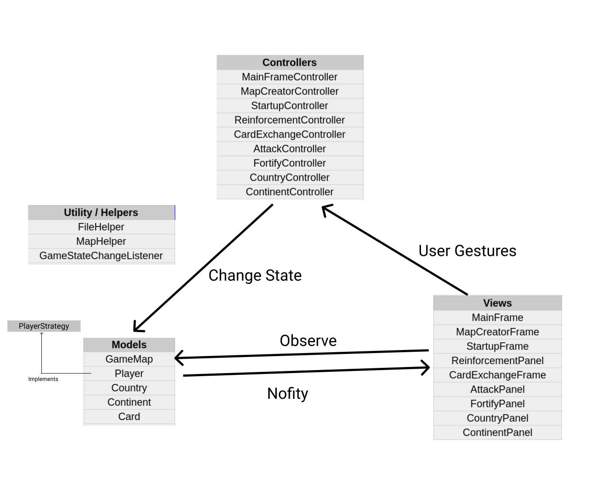

# Project Architecture

## Model-View-Controller (MVC)

#### Model
* Contains the state and business logic for the Game. 
* All the user actions are directed to model by controller to update the game state.

#### View
* Renders the game state provided by model. 
* Takes user interaction and pass it to controller.
* Gets the game state from controller and renders accordingly.

#### Controller
* Maps user interaction to model
* Handle user events/actions on view
* Pulls data from model for the updated content and updates view

## Singleton Design Pattern
* GameMap follows Singleton Pattern

## Utility/Helper Classes
* FileHelper
    - Provides functionality related to file handling (loading and saving map)
* MapHelper
    - Provides functionality related to map validation and verification
    - Loads map to GameMap instance